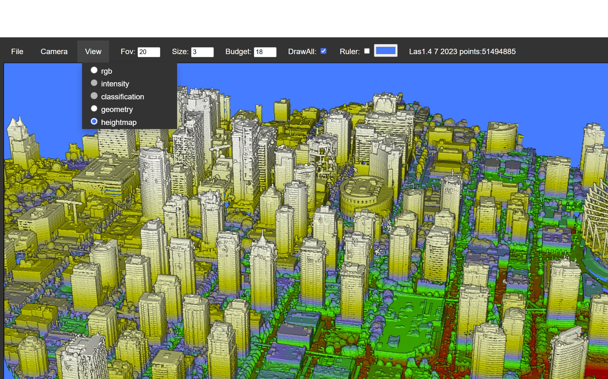

# Online Point Cloud Viewer  
 See it in action  here: https://lasviewer.github.io/  
 A web-based application to view LiDAR data in LAS format. It also supports XYZ ASCII files.   
 Viewer can render up to 250 million points without thinning.  
 source : https://github.com/polinomov/ezpoint3d/tree/good-experiment
 
